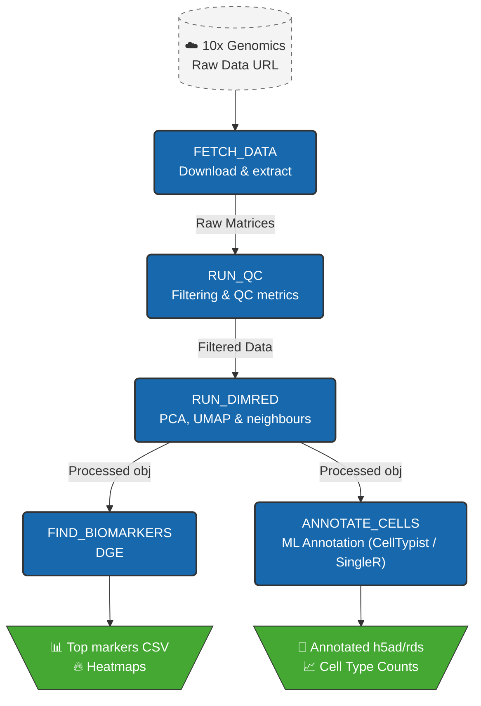

# 🧬 scRNA-seq Automated Nextflow Processing Pipeline
[](https://github.com/cemselb/nf-singlecell-biomarker/actions)
[](https://www.nextflow.io/)

A containerised, scalable **Nextflow** pipeline for scRNA-seq processing, machine learning-based annotation, and biomarker discovery.

## 🧬 Pipeline Architecture

This pipeline is modular and supports multiple backends (**Scanpy** for Python enthusiasts and **Seurat** for R users).



# Repo structure

```
nf-singlecell-biomarker/
├── main.nf
├── nextflow.config
├── bin/                    
│   └── run_scanpy_qc.py 
├── assets/                 
│   └── multiqc_config.yml ### not in use
├── .github/workflows/      
│   └── ci.yml   
└── README.md 
```

# How to
```markdown
curl -s [https://get.nextflow.io](https://get.nextflow.io) | bash
```

To run with **scanpy**
```markdown
nextflow run main.nf -profile conda --backend scanpy
```

To run with **Seurat**
```markdown
nextflow run main.nf -profile conda --backend seurat
```
